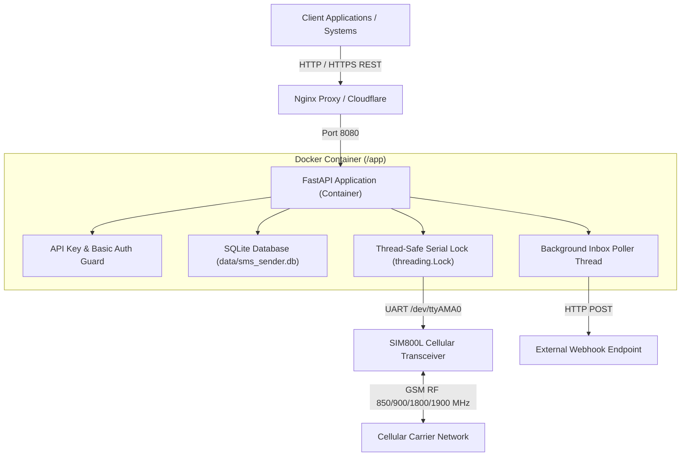
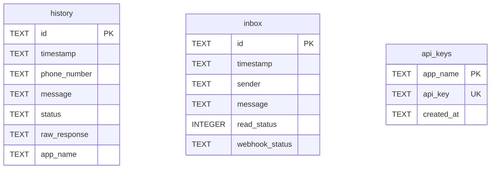
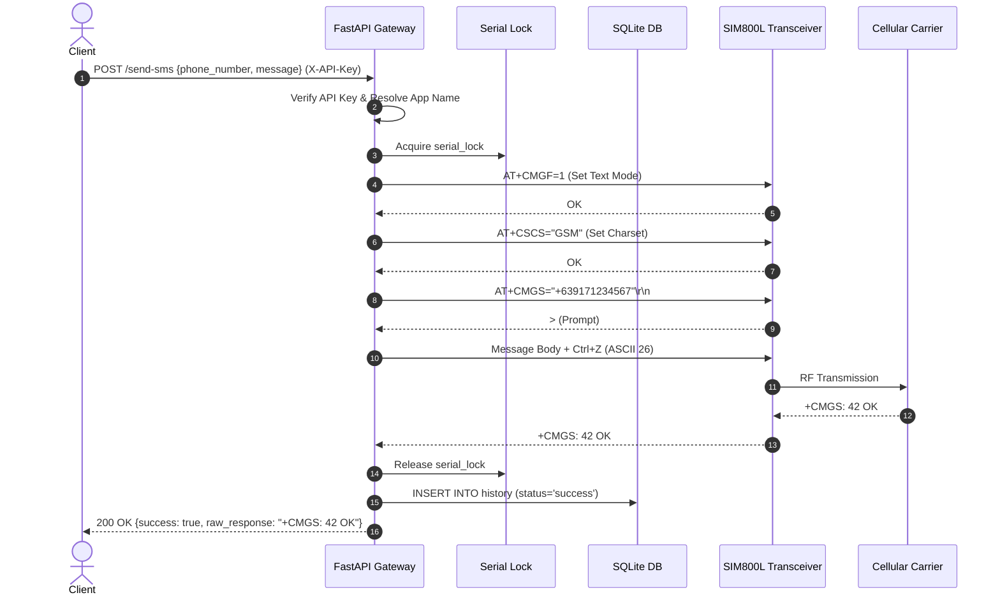
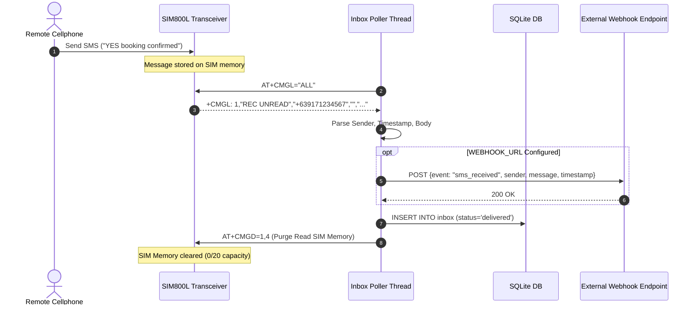

# System Architecture & Technical Specification

**SMS Sender Gateway (`sms-sender`)**  
A high-performance, Dockerized RESTful SMS API Gateway microservice running on Raspberry Pi 5 using a SIM800L cellular transceiver module.

---

## 1. System Architecture Overview

The `sms-sender` system bridges standard web client applications (Node.js, Python, PHP, Laravel, cURL) with physical GSM cellular networks. It translates high-level REST API calls into low-level Hayes AT commands executed over serial UART.



---

## 2. Hardware Architecture & Wiring

### 2.1 Raspberry Pi 5 & SIM800L Interface
The SIM800L module operates at **3.4V – 4.4V** (optimal **4.0V DC**) and requires peak transient currents of up to **2.0 Amps** during cellular transmission bursts.

```mermaid
flowchart LR
    power["5V / 12V External Power"] --> buck["LM2596 Buck Converter (Adjusted to 4.0V)"]
    buck -->|4.0V VCC| sim["SIM800L VCC Pin"]
    buck -->|GND| sim["SIM800L GND Pin"]
    
    pi5["Raspberry Pi 5"] -->|Pin 6 GND| sim["SIM800L GND (Common Ground)"]
    pi5 -->|Pin 8 TXD (GPIO 14)| sim["SIM800L RXD"]
    pi5 -->|Pin 10 RXD (GPIO 15)| sim["SIM800L TXD"]
    pi5 -->|Pin 11 (GPIO 17)| sim["SIM800L RST (Hardware Reset)"]
```

### 2.2 Complete Pin Map Table

| Raspberry Pi 5 Header | SIM800L Module | Function / Specification |
| :--- | :--- | :--- |
| **LM2596 OUT+ (4.0V)** | **VCC** | Main Power Input (4.0V DC / 2.0A peak) |
| **LM2596 OUT- (GND)** | **GND** | Power Ground |
| **Physical Pin 6 (GND)** | **GND** | **Common Ground** (Essential for serial logic reference) |
| **Physical Pin 8 (GPIO 14 / TXD)** | **RXD** | UART Data Transfer (Pi TX -> SIM800 RX) |
| **Physical Pin 10 (GPIO 15 / RXD)** | **TXD** | UART Data Receive (Pi RX <- SIM800 TX) |
| **Physical Pin 11 (GPIO 17)** | **RST** | Active-LOW Hardware Reset Pulse (200ms) |

> [!IMPORTANT]
> **Decoupling Capacitor Requirement**: A **1000µF – 2200µF Low-ESR electrolytic capacitor** must be soldered directly across the SIM800L `VCC` and `GND` pins to absorb RF transmit current spikes and prevent module brownout reboots (`Call Ready` errors).

---

## 3. Software Component Architecture

### 3.1 Core Layers
1. **ASGI Application Server**: Uvicorn running FastAPI (Python 3.11).
2. **Security & Authentication Layer**:
   - `HTTPBasicCredentials` guard for Web Dashboard routes (`/`, `/inbox`, `/history`, `/integration`, `/docs`).
   - `APIKeyHeader` (`X-API-Key`) validation for client application API requests.
3. **Database Persistence Layer**: `sqlite3` thread-safe manager writing to `data/sms_sender.db`.
4. **Serial Lock Manager**: `threading.Lock()` synchronizing all AT serial operations to prevent command collisions.
5. **Background Inbox Poller**: `daemon` thread polling unread SMS messages every 15 seconds.

---

## 4. Database Schema Specification (`data/sms_sender.db`)



---

## 5. Sequence & Data Flow Diagrams

### 5.1 Outbound SMS Dispatch Sequence (`POST /send-sms`)



### 5.2 Inbound SMS & Webhook Dispatch Sequence



---

## 6. Network & Reverse Proxy Architecture


---

## 7. Complete REST API Specifications

| Method | Endpoint | Authorization | Description |
| :--- | :--- | :--- | :--- |
| **`POST`** | `/send-sms` | `X-API-Key` | Transmits an SMS message to a phone number. |
| **`GET`** | `/api/inbox` | `X-API-Key` / Basic Auth | Retrieves received SMS inbox messages with pagination. |
| **`DELETE`** | `/api/inbox/{id}` | `X-API-Key` / Basic Auth | Deletes an inbox record by ID. |
| **`GET`** | `/api/history` | `X-API-Key` / Basic Auth | Retrieves dispatch history metrics & paginated records. |
| **`GET`** | `/health` | Public | Diagnostics check on serial port & SIM800L transceiver. |
| **`POST`** | `/api/hardware/reset` | `X-API-Key` / Basic Auth | Triggers GPIO 17 hardware pulse & AT soft-reset. |
| **`GET`** | `/api/keys` | Master Admin Key | Lists all registered application API keys. |
| **`POST`** | `/api/keys` | Master Admin Key | Generates a new application API key. |
| **`DELETE`** | `/api/keys/{name}` | Master Admin Key | Revokes an application API key. |

---

## 8. Deployment & Environment Variables

### `.env` Configuration File

```env
# HTTP Basic Auth credentials for Dashboard UI
DASHBOARD_USERNAME=admin
DASHBOARD_PASSWORD=your_secure_password

# Master Admin Key for API Key management & dispatch
SMS_SENDER_API_KEY=master_admin_api_key_12345

# Hardware Reset GPIO Pin (Default: 17 for physical Pin 11)
RESET_GPIO_PIN=17

# Optional Real-Time Webhook Target for Incoming SMS
WEBHOOK_URL=https://your-backend.abas.ph/api/sms-received
```
